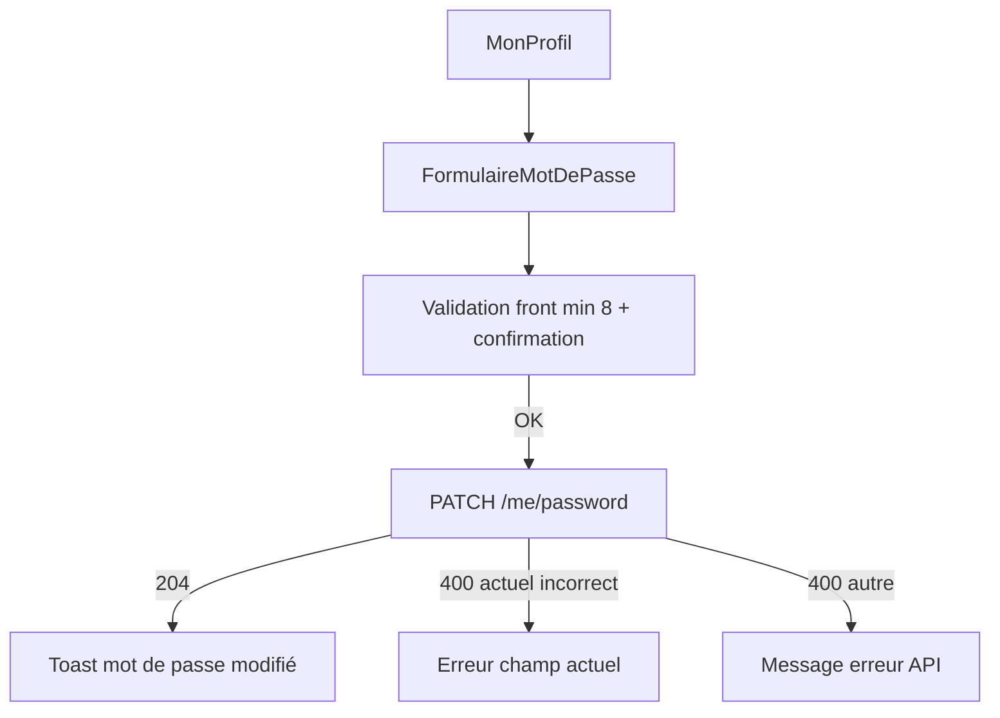

# Changer mon mot de passe — guide front

Documentation pour l'écran **Mon profil → Sécurité** (utilisateur **connecté**).

> Distinction avec le flux **mot de passe oublié** (public, demande admin) : voir [RESET_PASSWORD_FRONT.md](RESET_PASSWORD_FRONT.md).

## Accès

- **Authentification** : Bearer JWT obligatoire
- **Permission** : aucune (tout compte actif peut changer **son** mot de passe)
- **Emplacement UI suggéré** : onglet « Mon profil » ou « Paramètres du compte », section « Mot de passe »

## Endpoint

```http
PATCH /api/utilisateurs/me/password
Authorization: Bearer <token>
Content-Type: application/json

{
  "currentPassword": "ancienMotDePasse",
  "newPassword": "nouveauMotDePasse"
}
```

### Réponse succès

**204 No Content** — corps vide.

Afficher un message de confirmation (« Mot de passe modifié »). Le token JWT **reste valide** ; pas de déconnexion forcée côté backend.

### Corps de la requête

| Champ | Obligatoire | Règles |
|-------|-------------|--------|
| `currentPassword` | Oui | Mot de passe actuel du compte |
| `newPassword` | Oui | Minimum **8 caractères** ; doit être **différent** de l'actuel |

### Erreurs

| HTTP | Code / cas | Message backend (exemple) | Action UI |
|------|------------|---------------------------|-----------|
| 400 | Validation (`@NotBlank`, `@Size`) | « Le mot de passe doit contenir au moins 8 caractères » | Sous le champ concerné |
| 400 | Mot de passe actuel faux | « Mot de passe actuel incorrect » | Message sur le champ actuel |
| 400 | Nouveau = ancien | « Le nouveau mot de passe doit être différent de l'actuel » | Message global |
| 401 | Non connecté | — | Rediriger vers login |

Exemple erreur 400 :

```json
{
  "status": 400,
  "code": "BUSINESS_RULE_VIOLATION",
  "message": "Mot de passe actuel incorrect"
}
```

## Maquette formulaire

Champs recommandés :

1. **Mot de passe actuel** — `type="password"`, `autocomplete="current-password"`
2. **Nouveau mot de passe** — `type="password"`, `autocomplete="new-password"`, indicateur « min. 8 caractères »
3. **Confirmer le nouveau mot de passe** — validation **côté front uniquement** (le backend ne reçoit qu'un seul `newPassword`)

Bouton « Enregistrer » désactivé tant que les règles locales ne sont pas respectées.



## Exemple TypeScript

```typescript
async function changePassword(
  token: string,
  currentPassword: string,
  newPassword: string
): Promise<void> {
  const res = await fetch("/api/utilisateurs/me/password", {
    method: "PATCH",
    headers: {
      Authorization: `Bearer ${token}`,
      "Content-Type": "application/json",
    },
    body: JSON.stringify({ currentPassword, newPassword }),
  });

  if (res.status === 204) return;

  const err = await res.json().catch(() => ({}));
  throw new Error(err.message ?? "Impossible de modifier le mot de passe");
}
```

## Liens avec les autres écrans

| Besoin | Flux |
|--------|------|
| Utilisateur connecté, connaît son mot de passe | **Cet écran** (`PATCH /me/password`) |
| Utilisateur connecté, oublie son mot de passe | Lien « Mot de passe oublié » → [RESET_PASSWORD_FRONT.md](RESET_PASSWORD_FRONT.md) |
| Admin réinitialise un compte | `PUT /api/utilisateurs/{id}` avec `newPassword` — voir [GESTION_UTILISATEURS_FRONT.md](GESTION_UTILISATEURS_FRONT.md) |
| Admin traite une demande oubli | File `password-reset-requests` — voir [RESET_PASSWORD_FRONT.md](RESET_PASSWORD_FRONT.md) |

## Comptes seed (tests)

| Username | Mot de passe initial |
|----------|----------------------|
| `entreprise` | `123456` |
| `admin` | `admin` |
| `dgtcp` | `123456` |

Après changement via l'API, utiliser le **nouveau** mot de passe au prochain login.
