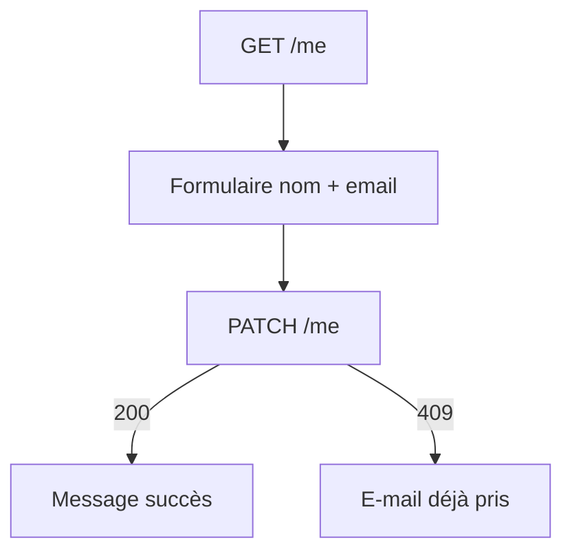
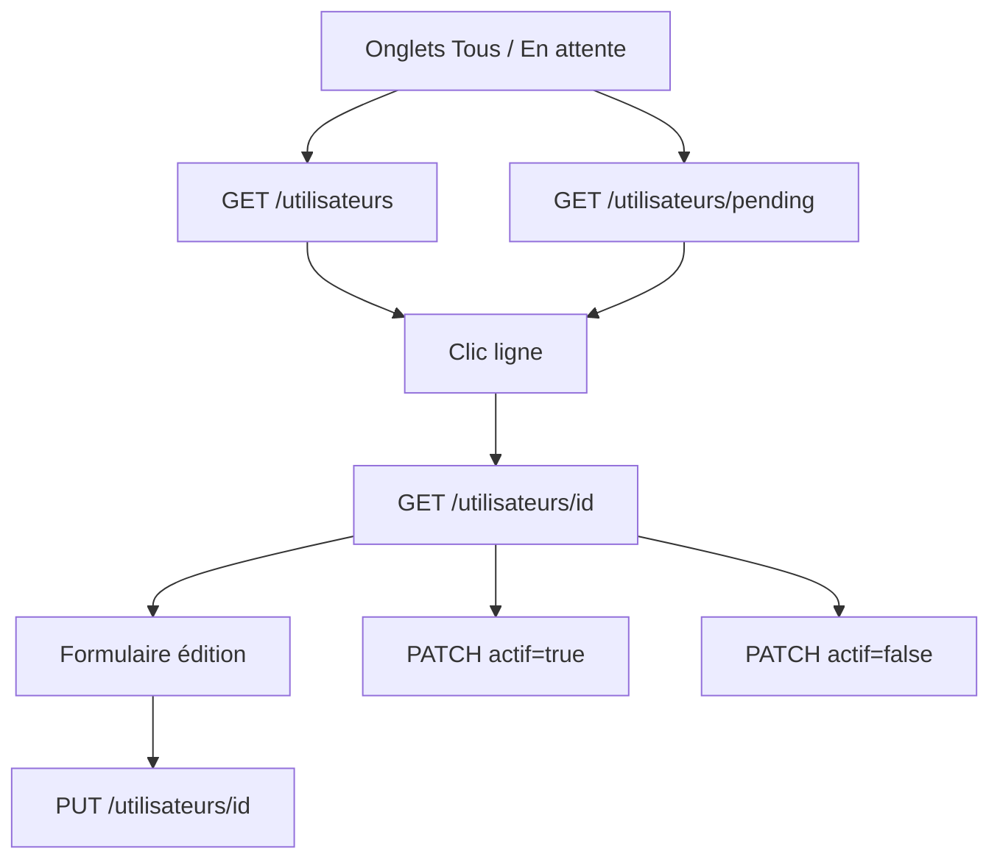

# Gestion utilisateurs — guide front

Documentation d'intégration pour l'écran **Mon profil** (tous utilisateurs) et l'écran **Administration des comptes** (permissions `user.list`, `user.update`, `user.disable`).

## Permissions

| Code | Rôles (seed) | Usage |
|------|--------------|-------|
| `user.list` | `ADMIN_SI`, `PRESIDENT` | Lister / consulter les comptes |
| `user.update` | `ADMIN_SI`, `PRESIDENT` | Modifier identité, rattachements, mot de passe |
| `user.role.assign` | `ADMIN_SI`, `PRESIDENT` | Modifier le **rôle** d'un compte |
| `user.disable` | `ADMIN_SI`, `PRESIDENT` | Activer / désactiver un compte |
| `user.reset` | `ADMIN_SI`, `DGI`, `PRESIDENT` | File reset mot de passe (voir [RESET_PASSWORD_FRONT.md](RESET_PASSWORD_FRONT.md)) |

Les permissions sont disponibles dans `LoginResponse.permissions`.

---

## 1. Mon profil (utilisateur connecté)

Accessible à **tout utilisateur authentifié** (entreprise, AC, commission, etc.).

### Consulter mon profil

```http
GET /api/utilisateurs/me
Authorization: Bearer <token>
```

Réponse :

```json
{
  "id": 12,
  "username": "entreprise",
  "role": "ENTREPRISE",
  "nomComplet": "Entreprise",
  "email": "contact@entreprise.mr",
  "actif": true,
  "autoriteContractanteId": null,
  "autoriteContractanteNom": null,
  "entrepriseId": 3,
  "entrepriseRaisonSociale": "Société Mauritanienne de Travaux Publics et Bâtiment (SMTPB)"
}
```

### Modifier mon profil

Seuls **nom complet** et **e-mail** sont modifiables par l'utilisateur lui-même.

```http
PATCH /api/utilisateurs/me
Authorization: Bearer <token>
Content-Type: application/json

{
  "nomComplet": "Nouveau nom affiché",
  "email": "nouveau@email.mr"
}
```

| Champ | Obligatoire | Notes |
|-------|-------------|-------|
| `nomComplet` | Non | Chaîne vide → efface le nom affiché |
| `email` | Non | Doit être unique ; requis pour le flux reset mot de passe |

Erreurs :

| HTTP | Cas |
|------|-----|
| 400 | Aucun champ fourni |
| 409 | E-mail déjà utilisé par un autre compte |
| 401 | Non authentifié |

### Changer mon mot de passe

Accessible à **tout utilisateur authentifié**. Documentation détaillée : [CHANGE_PASSWORD_FRONT.md](CHANGE_PASSWORD_FRONT.md).

```http
PATCH /api/utilisateurs/me/password
Authorization: Bearer <token>
Content-Type: application/json

{
  "currentPassword": "123456",
  "newPassword": "MonNouveauMotDePasse"
}
```

Réponse : **204 No Content**

| Champ | Règles |
|-------|--------|
| `currentPassword` | Obligatoire |
| `newPassword` | Obligatoire, min. 8 caractères, différent de l'actuel |

Erreurs fréquentes : **400** mot de passe actuel incorrect ; **400** nouveau mot de passe trop court ou identique à l'actuel.

---

## 2. Administration — liste et détail

### Liste de tous les comptes

```http
GET /api/utilisateurs
Authorization: Bearer <token>
```

Permission : `user.list`

### Comptes en attente de validation

```http
GET /api/utilisateurs/pending
Authorization: Bearer <token>
```

Retourne les comptes avec `actif: false` (inscription via `/api/auth/register`).

### Détail d'un compte

```http
GET /api/utilisateurs/{id}
Authorization: Bearer <token>
```

Permission : `user.list`

---

## 3. Administration — modification d'un compte

```http
PUT /api/utilisateurs/{id}
Authorization: Bearer <token>
Content-Type: application/json

{
  "nomComplet": "Agent DGTCP principal",
  "email": "dgtcp@finances.gov.mr",
  "role": "DGTCP",
  "autoriteContractanteId": null,
  "entrepriseId": null,
  "newPassword": "MotDePasse123"
}
```

Permission : `user.update`

Tous les champs sont **optionnels** ; seuls ceux envoyés sont mis à jour.

| Champ | Permission supplémentaire | Règles |
|-------|---------------------------|--------|
| `nomComplet` | — | Texte libre |
| `email` | — | Unique en base |
| `newPassword` | — | Min. 8 caractères ; hash BCrypt côté serveur |
| `role` | **`user.role.assign`** | Changement de rôle |
| `autoriteContractanteId` | — | Requis si rôle = `AUTORITE_CONTRACTANTE`, `AUTORITE_UPM`, `AUTORITE_UEP` |
| `entrepriseId` | — | Requis si rôle = `ENTREPRISE`, `SOUS_TRAITANT` |

### Règles de rattachement par rôle

| Rôle | `autoriteContractanteId` | `entrepriseId` |
|------|--------------------------|----------------|
| `AUTORITE_CONTRACTANTE`, `AUTORITE_UPM`, `AUTORITE_UEP` | **Obligatoire** (si absent en base) | Ignoré / effacé |
| `ENTREPRISE`, `SOUS_TRAITANT` | Ignoré / effacé | **Obligatoire** (si absent en base) |
| Commission (`DGD`, `DGTCP`, `DGI`, `DGB`, `PRESIDENT`, `ADMIN_SI`, `COMMISSION_RELAIS`) | Interdit | Interdit |

Exemple — rattacher une entreprise :

```json
{
  "role": "ENTREPRISE",
  "entrepriseId": 3
}
```

Exemple — rattacher une autorité contractante :

```json
{
  "role": "AUTORITE_CONTRACTANTE",
  "autoriteContractanteId": 1
}
```

Erreurs :

| HTTP | Cas |
|------|-----|
| 400 | Requête vide, rôle incohérent avec rattachement |
| 403 | Modification de rôle sans `user.role.assign` |
| 404 | Utilisateur, entreprise ou autorité introuvable |
| 409 | E-mail déjà utilisé |

---

## 4. Activation / désactivation

```http
PATCH /api/utilisateurs/{id}/actif?actif=true
Authorization: Bearer <token>
```

Permission : `user.disable`

Réponse : **204 No Content**

| `actif` | Effet |
|---------|-------|
| `true` | Compte validé — connexion autorisée |
| `false` | Compte désactivé — login refusé |

---

## 5. Maquettes écrans suggérées

### Écran « Mon profil »



### Écran « Gestion utilisateurs » (admin)



Champs du formulaire admin :

- Identifiant (lecture seule) : `username`
- Nom complet, e-mail
- Rôle (select — visible si `user.role.assign`)
- Autorité contractante ou entreprise (select conditionnel selon rôle)
- Nouveau mot de passe (optionnel, champ masqué)
- Statut actif + boutons Activer / Désactiver

---

## 6. Modèle TypeScript

```typescript
export interface UtilisateurDto {
  id: number;
  username: string;
  role: string;
  nomComplet?: string | null;
  email?: string | null;
  actif?: boolean | null;
  autoriteContractanteId?: number | null;
  autoriteContractanteNom?: string | null;
  entrepriseId?: number | null;
  entrepriseRaisonSociale?: string | null;
}

export interface UpdateMyProfileRequest {
  nomComplet?: string | null;
  email?: string | null;
}

export interface UpdateUtilisateurRequest {
  nomComplet?: string | null;
  email?: string | null;
  role?: string | null;
  autoriteContractanteId?: number | null;
  entrepriseId?: number | null;
  newPassword?: string | null;
}
```

---

## 7. Endpoints connexes

| Besoin | Documentation |
|--------|---------------|
| Inscription publique | `POST /api/auth/register` — compte créé `actif=false` |
| Reset mot de passe | [RESET_PASSWORD_FRONT.md](RESET_PASSWORD_FRONT.md) |
| Délégués AC (UPM/UEP) | `PATCH /api/delegues/{id}` — périmètre AC, pas admin global |
| Référentiel entreprises | `GET /api/entreprises`, `GET /api/entreprises/{id}`, `GET /api/entreprises/me` — permission `entreprise.list` (**tous les rôles**) |
| Référentiel autorités contractantes | `GET /api/autorites-contractantes` — tout utilisateur **authentifié** |
| Référentiel conventions | `GET /api/conventions` — `convention.view` ou `convention.view.all` (**tous les rôles**) |
| Référentiel marchés | `GET /api/marches` — `marche.view` (**tous les rôles**) |
| Référentiel projets | `GET /api/referentiels-projet` — `projet.view` ou `projet.view.all` (**tous les rôles**) |

> **Règle métier** : entreprise, AC, convention, marché et référentiel projet sont **visibles en lecture par tous les rôles** connectés (listes déroulantes, en-têtes de dossier DGD/DGTCP/entreprise, etc.). Seules les **actions** (création, visa, upload) restent limitées par rôle.

---

## 8. Checklist intégration front

- [ ] Page profil : `GET /me` au chargement
- [ ] Page profil : `PATCH /me` avec gestion 409 e-mail
- [ ] Liste admin filtrée par onglet « En attente » (`/pending`)
- [ ] Fiche utilisateur : `GET /{id}` avec champs rattachement
- [ ] Édition admin : `PUT /{id}` avec select rôle conditionnel
- [ ] Masquer le select rôle si `user.role.assign` absent des permissions JWT
- [ ] Validation compte : `PATCH /{id}/actif?actif=true`
- [ ] Désactivation : `PATCH /{id}/actif?actif=false` avec confirmation UI
