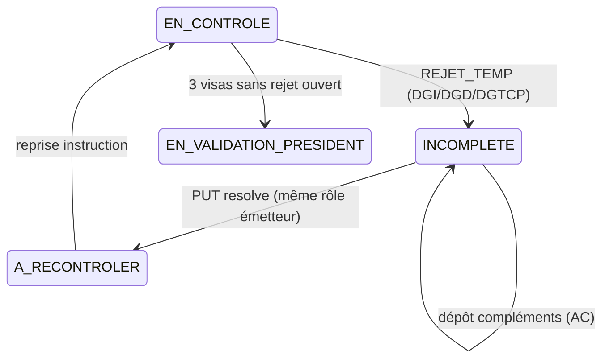

# Rejet temporaire — mise en place certificat (guide front)

Documentation pour le flux **REJET_TEMP** sur une demande de **mise en place** (`CertificatCredit`). Voir aussi [REJET_TEMPORAIRE.md](./REJET_TEMPORAIRE.md) pour la vue technique complète.

---

## 1. Cycle métier



| Étape | Acteur | Action | Statut certificat |
|-------|--------|--------|-------------------|
| 1 | DGI / DGD / DGTCP | `POST .../decisions` avec `REJET_TEMP` | `INCOMPLETE` |
| 2 | AC (ou entreprise) | Upload des documents demandés + message | `INCOMPLETE` |
| 3 | Émetteur du rejet | `PUT .../decisions/{id}/resolve` | `A_RECONTROLER` (si plus aucun rejet ouvert) |
| 4 | Émetteur | `POST .../decisions` avec `VISA` | inchangé jusqu’aux 3 visas |

> **`PUT .../resolve` ne pose pas de visa.** Il marque uniquement la décision ciblée comme `RESOLU`.

---

## 2. Émettre un rejet temporaire (commission)

### API

```http
POST /api/certificats-credit/{certificatId}/decisions
Content-Type: application/json
Authorization: Bearer {token DGI|DGD|DGTCP}
```

```json
{
  "decision": "REJET_TEMP",
  "motifRejet": "Pièces contractuelles incomplètes",
  "documentsDemandes": ["CONTRAT", "CERTIFICAT_NIF"]
}
```

### Règles backend

- **Motif** obligatoire.
- **`documentsDemandes`** obligatoire, non vide.
- Chaque code doit être **paramétré GED** pour le processus `MISE_EN_PLACE_CI` :
  - `LETTRE_SAISINE`
  - `CONTRAT`
  - `LETTRE_NOTIFICATION_CONTRAT`
  - `CERTIFICAT_NIF`
  - `LETTRE_CORRECTION`
  - `CERTIFICAT_CREDIT_IMPOTS`
- Statuts autorisés pour décider : `EN_CONTROLE`, `INCOMPLETE`, `A_RECONTROLER`.
- Un **visa** du même rôle bloque tout nouveau `REJET_TEMP`.
- Tant qu’un `REJET_TEMP` **OUVERT** existe pour le rôle, **visa interdit** pour ce rôle.

### Erreurs fréquentes

| HTTP | Code | Message |
|------|------|---------|
| `400` | `BUSINESS_RULE_VIOLATION` | Motif ou liste documents manquants |
| `400` | `BUSINESS_RULE_VIOLATION` | `Types de documents non paramétrés pour MISE_EN_PLACE_CI: [...]` |
| `403` | `ROLE_FORBIDDEN` | Rôle autre que DGI/DGD/DGTCP |

---

## 3. Notifications et e-mail (AC + entreprise)

À l’émission d’un `REJET_TEMP`, le backend notifie :

- les utilisateurs **entreprise** liés au certificat ;
- les utilisateurs **autorité contractante** liés à la demande de correction parente ;
- l’**émetteur** (DGI/DGD/DGTCP) est exclu des destinataires.

### Type notification

`REJET_TEMP_DECISION` — `entityType`: `CertificatCredit`, `entityId`: id certificat.

### Payload utile front

```json
{
  "eventCode": "CERTIFICAT_REJET_TEMP",
  "dossierLabel": "CI-2025-001",
  "newStatus": "INCOMPLETE",
  "statut": "INCOMPLETE",
  "motif": "Pièces contractuelles incomplètes",
  "motifRejet": "Pièces contractuelles incomplètes",
  "documentsDemandes": ["CONTRAT", "CERTIFICAT_NIF"],
  "redirectPath": "/dashboard/certificats/42",
  "decisionId": 12,
  "acteurRole": "DGD",
  "acteurUserId": 7
}
```

### Deep-link et handler

Utiliser **`payload.redirectPath`** au clic (priorité absolue). Handler générique, matrice `eventCode` et fallback anciennes notifications : **[NOTIFICATIONS_NAVIGATION_FRONT.md](./NOTIFICATIONS_NAVIGATION_FRONT.md)** (section REJET_TEMP).

Résumé certificat : après navigation, afficher le bandeau compléments si `documentsDemandes` non vide ; optionnel `#rejet-temp-{decisionId}`.

### Autres événements

| Événement | `NotificationType` | Destinataires principaux |
|-----------|-------------------|--------------------------|
| Dépôt complément | `REJET_TEMP_REPONSE` | Rôle émetteur (DGI/DGD/DGTCP) |
| Résolution | `REJET_TEMP_RESOLU` | AC + entreprise |

Payload résolution : `newStatus: "A_RECONTROLER"`, `redirectPath` identique.

WebSocket : `/topic/notifications/user/{userId}` (inchangé).

---

## 4. Répondre au rejet (AC)

Le dépôt se fait via **upload GED certificat**, pas uniquement par message texte.

### Upload document demandé

```http
POST /api/certificats-credit/{certificatId}/documents
Content-Type: multipart/form-data

codeDocument=CONTRAT
message=Contrat signé joint
file=@contrat.pdf
```

- **`codeDocument`** : doit figurer dans `documentsDemandes` d’au moins un rejet **OUVERT**.
- **`message`** : **obligatoire** si un rejet ouvert demande ce code.
- Types autorisés : selon paramétrage GED (`PDF`, `WORD`, etc.).

Effet : enregistrement `RejetTempResponse` + notification `REJET_TEMP_REPONSE` vers le rôle émetteur.

### Réponse texte seule (sans fichier)

```http
POST /api/certificats-credit/decisions/{decisionId}/rejet-temp/reponses
Content-Type: application/json

{ "message": "Précisions sur le contrat" }
```

### Remplacement d’une version

En statut `INCOMPLETE`, l’**AC** peut remplacer un document déjà déposé si ce code a été **demandé** par un rejet ouvert.

---

## 5. Résoudre le rejet (commission émettrice)

```http
PUT /api/certificats-credit/decisions/{decisionId}/resolve
Authorization: Bearer {token même rôle que decision.role}
```

Conditions :

- décision = `REJET_TEMP`, `rejetTempStatus = OUVERT` ;
- JWT du **même rôle** que `decision.role`.

Si **plus aucun** rejet ouvert sur le certificat et statut `INCOMPLETE` → passage **`A_RECONTROLER`** + notification `REJET_TEMP_RESOLU`.

Ensuite le contrôleur peut apposer son **visa** :

```json
POST /api/certificats-credit/{id}/decisions
{ "decision": "VISA" }
```

---

## 6. Modèle UI recommandé

### Affichage des rejets ouverts

Source : `GET /api/certificats-credit/{id}/decisions`

Filtrer `decision === "REJET_TEMP" && rejetTempStatus === "OUVERT"`.

Pour chaque décision afficher :

- `role`, `motifRejet`, `documentsDemandes[]`, `dateDecision`
- `rejetTempResponses[]` (historique réponses)
- bouton **Résoudre** (visible si `user.role === decision.role`)

### Bandeau compléments (AC / entreprise)

Quand `statut === "INCOMPLETE"` :

1. Agréger tous les `documentsDemandes` des rejets ouverts (union).
2. Pour chaque code, proposer upload avec champ **message** obligatoire.
3. Libellés : i18n sur `codeDocument` (référentiel types documents).

```typescript
type RejetTempDecision = {
  id: number;
  role: string;
  decision: "REJET_TEMP";
  rejetTempStatus: "OUVERT" | "RESOLU";
  motifRejet: string;
  documentsDemandes: string[];
  rejetTempResponses?: Array<{
    message: string;
    codeDocument?: string;
    documentUrl?: string;
    createdAt: string;
  }>;
};

function openDocumentsFromDecisions(decisions: RejetTempDecision[]): string[] {
  const codes = new Set<string>();
  decisions
    .filter((d) => d.decision === "REJET_TEMP" && d.rejetTempStatus === "OUVERT")
    .flatMap((d) => d.documentsDemandes ?? [])
    .forEach((c) => codes.add(c));
  return [...codes];
}
```

### Handler notification

Voir le handler unifié `resolveNotificationLink` dans [NOTIFICATIONS_NAVIGATION_FRONT.md](./NOTIFICATIONS_NAVIGATION_FRONT.md). Exemple certificat après navigation :

```typescript
function onCertificatRejetTempNotification(n: NotificationDto) {
  const p = n.payload ?? {};
  if (p.eventCode !== "CERTIFICAT_REJET_TEMP") return;
  const docs = (p.documentsDemandes as string[]) ?? [];
  if (docs.length) {
    toast.info(`Compléments demandés : ${docs.map(tTypeDocument).join(", ")}`);
  }
  navigate(resolveNotificationLink(n));
}
```

---

## 7. Permissions (rappel)

| Action | Permission typique |
|--------|-------------------|
| Décider (visa / rejet) | `mise_en_place.dgi.decide`, `mise_en_place.dgd.decide`, `mise_en_place.dgtcp.decide` |
| Résoudre | `mise_en_place.dgi.resolve`, `mise_en_place.dgd.resolve`, `mise_en_place.dgtcp.resolve` |
| Upload compléments | `mise_en_place.submit` (AC) |
| Consulter file | `mise_en_place.*.queue.view`, `mise_en_place.entreprise.queue.view` |

---

## 8. Tests manuels rapides

1. DGD : `REJET_TEMP` avec `documentsDemandes: ["CONTRAT"]` sur certificat `EN_CONTROLE`.
2. AC : vérifier notification `REJET_TEMP_DECISION` + e-mail ; payload contient `documentsDemandes` et `redirectPath`.
3. AC : `POST .../documents?codeDocument=CONTRAT` + message → DGD reçoit `REJET_TEMP_REPONSE`.
4. DGD : `PUT .../decisions/{id}/resolve` → AC reçoit `REJET_TEMP_RESOLU`, statut `A_RECONTROLER`.
5. DGD : `POST .../decisions` `{ "decision": "VISA" }` après résolution.

Compte seed : `ac` / `123456`, `dgd` / `123456`, `entreprise` / `123456`.
