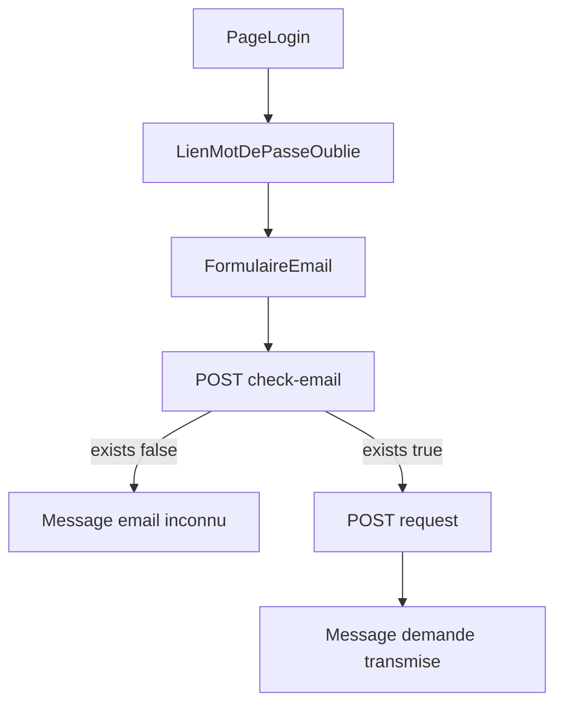

# Réinitialisation mot de passe — guide front

Documentation d'intégration pour l'écran **Mot de passe oublié** (public) et la **file admin** (authentifiée).

## 1. Écran public — Mot de passe oublié

Accessible sans connexion (ex. lien depuis la page login).

### Étape A — Saisie e-mail + vérification

```http
POST /api/auth/password-reset/check-email
Content-Type: application/json

{ "email": "user@example.com" }
```

Réponse :

```json
{ "exists": true }
```

| `exists` | Action UI |
|----------|-----------|
| `false` | Afficher « Cet e-mail n'est pas enregistré sur un compte actif » |
| `true` | Activer le bouton « Envoyer la demande » |

### Étape B — Envoi de la demande

```http
POST /api/auth/password-reset/request
Content-Type: application/json

{ "email": "user@example.com" }
```

Réponse attendue : **202 Accepted**

```json
{
  "message": "Si l'e-mail est enregistré, votre demande a été transmise à l'administrateur."
}
```

Afficher ce message de confirmation (même en cas d'e-mail inconnu côté backend).

Erreurs possibles :

| HTTP | Cas | Message suggéré |
|------|-----|-----------------|
| 409 | Demande déjà en attente | « Une demande est déjà en cours pour ce compte » |
| 409 | E-mail ambigu (plusieurs comptes) | « Contactez l'administrateur » |
| 400 | E-mail invalide | Validation formulaire |

### Maquette flux



## 2. Écran admin — Demandes de reset

Réservé aux utilisateurs avec permission **`user.reset`** (présente dans `LoginResponse.permissions`).

### Liste des demandes en attente

```http
GET /api/utilisateurs/password-reset-requests?statut=EN_ATTENTE
Authorization: Bearer <token>
```

Réponse (tableau) :

```json
[
  {
    "id": 1,
    "utilisateurId": 5,
    "username": "entreprise",
    "nomComplet": "Entreprise démo",
    "email": "entreprise@example.com",
    "statut": "EN_ATTENTE",
    "dateCreation": "2026-04-30T12:00:00Z",
    "dateTraitement": null,
    "traiteParId": null,
    "traiteParUsername": null,
    "motifRefus": null
  }
]
```

Colonnes UI recommandées : username, nomComplet, email, dateCreation, actions.

### Approuver

```http
PATCH /api/utilisateurs/password-reset-requests/{id}/approve
Authorization: Bearer <token>
```

Pas de body. Réponse : objet `DemandeResetPasswordDto` avec `statut: "APPROUVEE"`.

**Important** : le mot de passe est envoyé **uniquement par e-mail** à l'utilisateur — ne pas l'afficher dans l'UI admin.

Toast suggéré : « Demande approuvée — un e-mail a été envoyé à l'utilisateur ».

### Refuser

```http
PATCH /api/utilisateurs/password-reset-requests/{id}/reject
Authorization: Bearer <token>
Content-Type: application/json

{ "motif": "Identité non vérifiée" }
```

Réponse : `statut: "REFUSEE"`, `motifRefus` renseigné si fourni.

### Notifications in-app

Les admins reçoivent une notification **`PASSWORD_RESET_REQUEST`** à la création d'une demande.

L'utilisateur reçoit **`PASSWORD_RESET_TRAITEE`** après approbation ou refus.

WebSocket : `/topic/notifications/user/{userId}` (inchangé).

## 3. Exemple TypeScript (api.ts)

```typescript
export async function checkPasswordResetEmail(email: string): Promise<{ exists: boolean }> {
  const res = await fetch(`${API_BASE}/api/auth/password-reset/check-email`, {
    method: 'POST',
    headers: { 'Content-Type': 'application/json' },
    body: JSON.stringify({ email }),
  });
  if (!res.ok) throw new Error('Erreur vérification e-mail');
  return res.json();
}

export async function requestPasswordReset(email: string): Promise<{ message: string }> {
  const res = await fetch(`${API_BASE}/api/auth/password-reset/request`, {
    method: 'POST',
    headers: { 'Content-Type': 'application/json' },
    body: JSON.stringify({ email }),
  });
  if (res.status === 409) {
    const err = await res.json().catch(() => ({}));
    throw new Error(err.message || 'Demande impossible');
  }
  if (!res.ok) throw new Error('Erreur envoi demande');
  return res.json();
}

export async function listPasswordResetRequests(
  token: string,
  statut: 'EN_ATTENTE' | 'APPROUVEE' | 'REFUSEE' = 'EN_ATTENTE'
) {
  const res = await fetch(
    `${API_BASE}/api/utilisateurs/password-reset-requests?statut=${statut}`,
    { headers: { Authorization: `Bearer ${token}` } }
  );
  if (!res.ok) throw new Error('Accès refusé');
  return res.json();
}

export async function approvePasswordReset(token: string, id: number) {
  const res = await fetch(
    `${API_BASE}/api/utilisateurs/password-reset-requests/${id}/approve`,
    { method: 'PATCH', headers: { Authorization: `Bearer ${token}` } }
  );
  if (!res.ok) throw new Error('Approbation échouée');
  return res.json();
}

export async function rejectPasswordReset(token: string, id: number, motif?: string) {
  const res = await fetch(
    `${API_BASE}/api/utilisateurs/password-reset-requests/${id}/reject`,
    {
      method: 'PATCH',
      headers: {
        Authorization: `Bearer ${token}`,
        'Content-Type': 'application/json',
      },
      body: JSON.stringify({ motif: motif ?? '' }),
    }
  );
  if (!res.ok) throw new Error('Refus échoué');
  return res.json();
}
```

## 4. Garde de route front

- Page admin reset : visible si `permissions.includes('user.reset')`.
- Page forgot password : route publique (pas de guard JWT).

## 5. Références backend

- [GESTION_RESET_PASSWORD.md](GESTION_RESET_PASSWORD.md)
- [API-ENDPOINTS.md](../API-ENDPOINTS.md) — sections auth et utilisateurs
